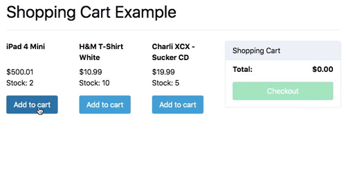

Shopping Cart Example in Elm ([Demo](https://y-taka-23.github.io/elm-shopping-cart/))
============================

[](https://circleci.com/gh/y-taka-23/dynamodbenums/tree/master)

An Elm porting from the Shopping Cart example in [Vuex](https://vueschool.io/courses/vuex-for-everyone).



```bash
$ git clone https://github.com/y-taka-23/elm-shopping-cart.git
$ cd elm-shopping-cart
$ yarn
$ yarn dev  # serves the example at http://localhost:8080
```

Reference
---------

* [Vuex for Everyone](https://vueschool.io/courses/vuex-for-everyone)
* [Shopping Cart Example](https://github.com/vuejs/vuex/tree/dev/examples/shopping-cart)
